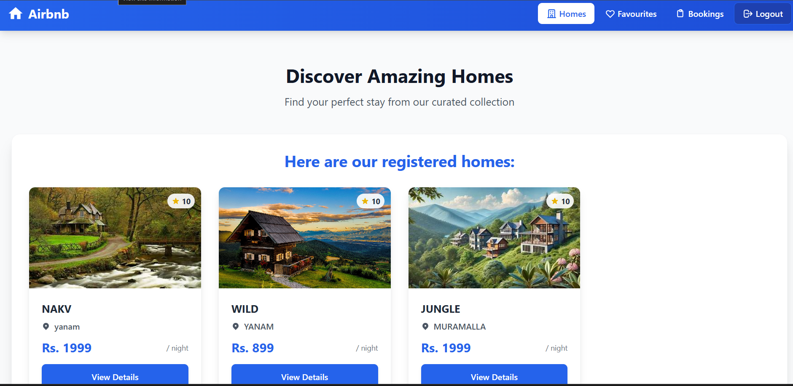
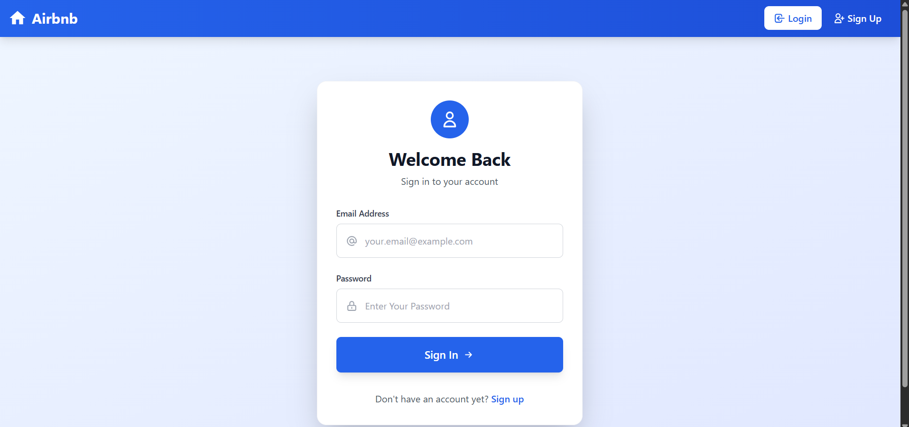
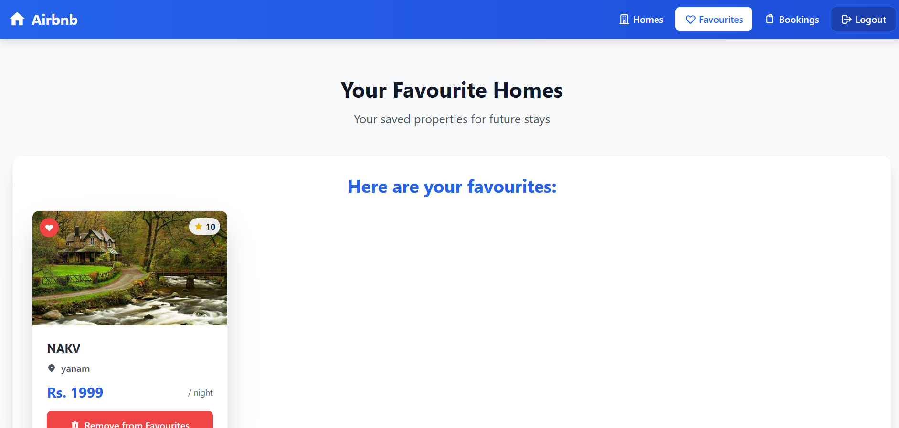

# Airbnb Clone (SSR)

A server-side rendered Airbnb Clone built with Node.js, Express, MongoDB, and TailwindCSS.  
It includes authentication, authorization, sessions, and personalized features like user favourites.

---

## 🚀 Live Demo  
🔗 [Deployed on Render](https://airbnb-clone-ssr.onrender.com)

---

## ✨ Features  
- User registration and login with bcryptjs password hashing  
- Session management with express-session and connect-mongodb-session  
- Authentication and Authorization for Guests & Hosts  
- Personalized Favourites (users can save homes)  
- File upload support with multer  
- Styled with TailwindCSS  
- Server-side rendering using EJS  

---

## 📸 Screenshots  
  
  
  

---

## 🛠️ Tech Stack  
- **Frontend**: TailwindCSS, EJS (SSR)  
- **Backend**: Node.js, Express.js  
- **Database**: MongoDB, MySQL2 (for learning both relational and NoSQL)  
- **Authentication**: bcryptjs, express-session  
- **Other Tools**: multer, dotenv, express-validator  

---

## 📂 Project Structure  

```
├── app.js
├── package.json
├── views/        # EJS templates
├── public/       # Static files (Tailwind output CSS, images, etc.)
├── models/       # Database models
├── routes/       # Express routes
└── controllers/  # Route logic
```

---

## ⚡ Installation & Setup  

Clone the repository and install dependencies:  

```bash
git clone git@github.com:VNeeha/airbnb-clone-ssr.git
cd airbnb-clone-ssr
npm install
```

Create a `.env` file:  

```env
PORT=3000
MONGO_URI=your-mongo-connection-string
SESSION_SECRET=your-secret
```

Build CSS with Tailwind:  

```bash
npm run build
```

Run the app:  

```bash
npm start
```

For development (auto-restart + Tailwind watch):  

```bash
npm run dev
```

---

## 📌 Deployment  
This app is deployed on Render.  

**Build command:**  
```bash
npm run build
```  

**Start command:**  
```bash
npm start
```  

---

## 🙌 Acknowledgements  
Inspired by Airbnb. Built as a learning project to practice SSR, authentication, and database integration.  
